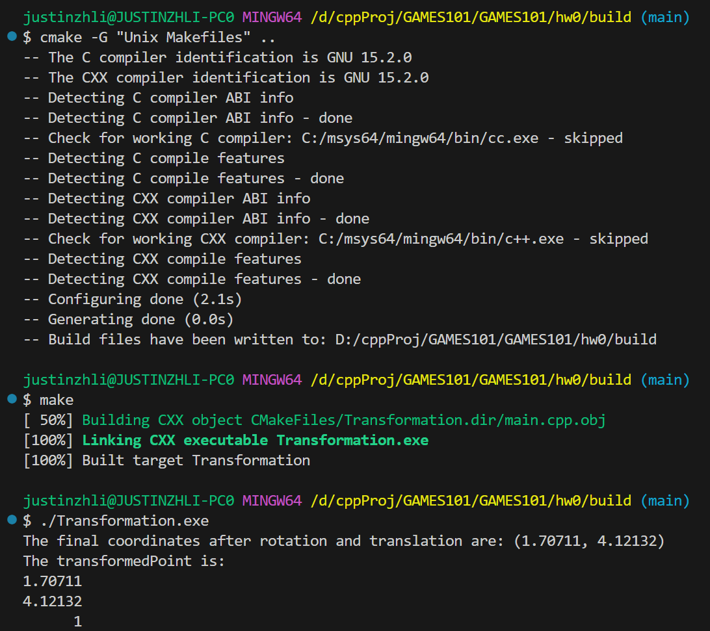

windows下载第三方库的套路：
- git clone https://gitlab.com/libeigen/eigen.git
- mkdir build 
- cd build
- cmake -G "Unix Makefiles" ..
- make -j4
- make install

cmake -G "Unix Makefiles" ..
make

# 因为我的远程服务器内存2G太小无法构建流畅的图形化界面ubuntu，所以直接改成Windows环境下算了。。。

